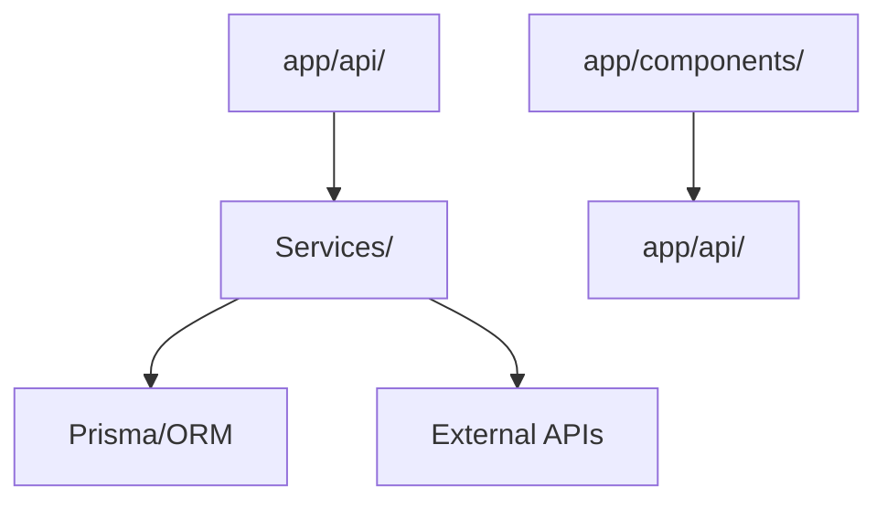

# Scan Codebase

Produce a structured orientation map of the repository for use in planning, onboarding, and Large-scope implementation.

## Trigger Conditions

Run this skill when:
- The user executes `/scan`
- A Large-scope task begins and the codebase structure is not yet mapped
- Another agent or skill requests a codebase orientation before planning

## Scan Protocol

### Phase 1 — Entry Points
Identify the top-level entry points of the application:
- Backend: `artisan`, `server.js`, `index.ts`, `main.py`, `cmd/main.go`, `Gemfile` root
- Frontend: `src/main.tsx`, `src/index.tsx`, `app/layout.tsx`, `pages/_app.tsx`
- API: `routes/api.php`, `src/routes/`, `app/api/`
- CLI / scripts: `scripts/`, `bin/`, `Makefile`, `Taskfile`

### Phase 2 — Architectural Layers
Map the layers present. Check for:

| Layer | Common Paths |
|---|---|
| Routing | `routes/`, `app/routes/`, `src/router/`, `app/api/` |
| Controllers / Handlers | `app/Http/Controllers/`, `src/handlers/`, `src/controllers/` |
| Services / Use Cases | `app/Services/`, `src/services/`, `src/use-cases/` |
| Data Access | `app/Models/`, `src/models/`, `prisma/schema.prisma`, `drizzle/` |
| Validation | `app/Http/Requests/`, `src/validators/`, `src/schemas/` |
| Jobs / Workers | `app/Jobs/`, `src/queues/`, `workers/` |
| Events / Listeners | `app/Events/`, `src/events/` |
| Middleware | `app/Http/Middleware/`, `src/middleware/` |
| Tests | `tests/`, `__tests__/`, `spec/`, `cypress/`, `e2e/` |
| Config | `config/`, `.env.example`, `src/config/` |

### Phase 3 — Conventions
Identify the project's established conventions:
- **Naming**: snake_case vs camelCase vs PascalCase in file names
- **Module pattern**: feature-based folders vs type-based folders
- **Test colocation**: tests alongside source files or in a separate `tests/` tree
- **Import aliases**: `@/`, `~/`, `~~/` — check `tsconfig.json`, `vite.config.*`, `webpack.config.*`
- **Code style**: presence of `.eslintrc`, `phpcs.xml`, `prettier.config.*`, `rustfmt.toml`

### Phase 4 — Dependencies Inventory
From the primary manifest (`package.json`, `composer.json`, `pyproject.toml`):
- List primary framework (Laravel, Express, Next.js, etc.)
- List ORM / database client (Prisma, Eloquent, Mongoose, SQLAlchemy, etc.)
- List testing frameworks (Pest, Vitest, Jest, pytest, Playwright, Cypress, Detox)
- List auth library (Sanctum, Passport, NextAuth, Clerk, etc.)
- List notable infrastructure packages (queues, search, cache, email)

### Phase 5 — Output Format
Produce a structured Mermaid diagram + summary table. Example:

Followed by a table:

| Layer | Path | Pattern |
|---|---|---|
| Routing | `app/api/` | Next.js App Router |
| Data Access | `prisma/schema.prisma` | Prisma ORM |
| Auth | `lib/auth.ts` | NextAuth.js |
| Tests | `tests/` + `e2e/` | Vitest + Playwright |

## Output Contract

The scan must produce:
1. A **Mermaid architecture diagram** representing the primary data flow
2. A **Layer inventory table** (path, pattern, key files)
3. A **Convention summary** (naming, module pattern, test colocation)
4. A **Dependencies inventory** (framework, ORM, testing, auth, infra)
5. A **Risk surface note**: layers that touch auth, user input, external services, or async operations (triggers Security Iron Law and Defensive Coding at those boundaries)

Save output to `docs/ai/implementation/codebase-map.md` when the user confirms.

## Session Closure — Atomic Instinct (mandatory)

Before ending, evaluate whether the scan produced a **Pattern Change**, **RCA Discovery**, or **Course Correction** insight. If yes, append one tagged bullet to `.github/lessons-learned.md`. If none apply, remain silent.
