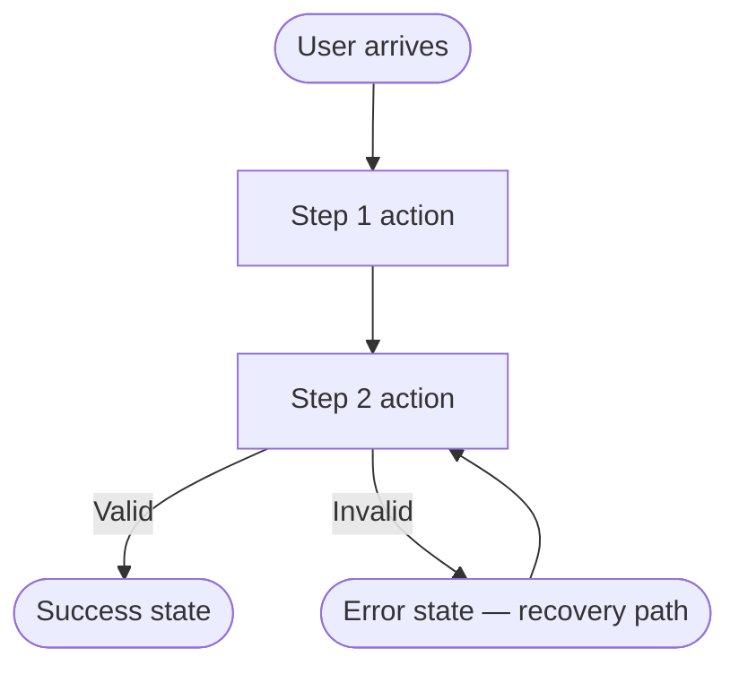

# UX Design Skill

Ensure every feature provides a clear, humane user experience — not just a working one. UX discipline is required before and during implementation of any user-facing feature.

## When to Activate

- Before implementing any multi-step feature, wizard, or checkout flow
- When designing or modifying navigation structures (menus, tabs, breadcrumbs)
- When building forms with validation, multi-step state, or complex submission behavior
- When a feature can result in an error, empty state, or loading delay visible to the user
- When `/redesign` is triggered or a feature brief references user flows

---

## Step 1 — Map the User Flow (Mandatory for Multi-Step Features)

Before writing any code for a multi-step feature, produce a flow diagram:

The diagram must show:
- Entry point(s)
- Each decision or branching point
- Success state
- Error state with a recovery path back into the flow
- Exit points (cancel, complete, timeout)

If no diagram is feasible in the current context, state the flow in numbered prose and identify every branch.

---

## Navigation Patterns

### Breadcrumbs
- Use breadcrumbs on pages 2+ levels deep.
- Breadcrumb items link to their respective pages — they are not decorative.
- The current page is the last crumb and is **not** a link.

### Back Button / Browser Navigation
- Multi-step flows must support browser back-button navigation without data loss.
- Use URL state (query params or path segments) to represent step position so users can share or bookmark steps.
- On back-navigation, restore the user's previous input — do not reset the form.

### Deep Linking
- Every significant application state must be addressable by URL.
- Filter/sort state on list pages belongs in query params, not component state.
- Modal content that represents a discrete entity (e.g., `/orders/123`) must have its own canonical URL.

---

## Form UX

### Progressive Disclosure
- Show only the fields relevant to the current step.
- Reveal conditional fields with smooth transitions — do not hide them with `display: none` before the user has answered the conditioning question, as screen readers may still announce them.

### Smart Defaults
- Pre-fill fields from the authenticated user's profile where safe (name, email, shipping address).
- Default radio buttons and selects to the most common valid choice — never leave the user with an invalid pre-selected state.

### Inline Validation
- Validate on blur (field exit), not on keystroke — do not interrupt the user while typing.
- Show success indicators (green check) only for fields with non-trivial validation (email format, username uniqueness).
- Show errors inline below the field, not only in a top-level banner.

### Multi-Step Form State
- Persist partial form data across steps (URL params, sessionStorage, or server-side draft).
- Show a progress indicator for forms with 3+ steps.
- The final step shows a review/confirm screen before destructive or irreversible submission.
- On submission failure, return the user to the step with the error — do not restart the whole form.

### Submit Behavior
- Disable or show a loading state on the submit button after click to prevent double-submission.
- Re-enable on error so the user can retry.
- Successful submission navigates or produces a clear success state — never leave the user on a blank form after success.

---

## Interaction States

Every interactive element must have all applicable states designed and implemented:

| Element | Required States |
|---|---|
| Button | Default, Hover, Focus (`:focus-visible`), Active, Loading, Disabled |
| Link | Default, Hover, Focus, Visited (where semantically relevant) |
| Input | Default, Focus, Filled, Error, Disabled, Readonly |
| Checkbox / Radio | Unchecked, Checked, Indeterminate (if applicable), Disabled |
| Toggle / Switch | Off, On, Loading (for async toggles), Disabled |
| Card (clickable) | Default, Hover, Focus, Selected, Disabled |

Omitting any applicable state is a UX violation — the agent must not deliver incomplete interaction state coverage.

---

## Error Recovery UX

The goal of an error state is not to report failure — it is to **guide the user back to success**.

### Error Message Rules
- Use active voice: "Your session expired — please sign in again" not "Session expired."
- Tell the user what to do next, not just what went wrong.
- For validation: say which field failed and why: "Email is already registered — try logging in instead."
- For server errors: offer a retry action and, where possible, contact/support link.

### Partial Failure
- If a batch action partially succeeds, report which items succeeded and which failed separately.
- Provide a recovery action for the failed subset — not a "try again" that would re-run the already-successful items.

### Session Expiry
- Alert the user before they lose unsaved work when a session is nearing expiry.
- On expiry: offer "Save and sign in again" rather than silently discarding the form.

---

## Empty States

Every list, table, dashboard widget, and search result **must** have a designed empty state.

An empty state must include:
1. **Illustration or icon** — contextual, not generic loading spinner
2. **Headline** — explains what is empty and why ("No orders yet" not "Empty")
3. **Call-to-action** — a clear next step ("Place your first order →")
4. **For search/filter results**: distinguish "no results for this query" (offer to clear filters) from "nothing exists yet" (offer to create)

---

## Confirmation Patterns

- Destructive actions (delete, archive, revoke) require a confirmation step.
- Confirmation dialogs state *exactly* what will be deleted and whether the action is reversible.
- Batch destructive operations show the affected count before confirmation.
- Use the pattern: [Cancel] [Confirm — Delete 3 items] — the confirm button labels the action explicitly.

---

## Session Closure — Atomic Instinct (mandatory)

Use `.github/copilot-instructions.md` → Session Intelligence → Atomic Instincts as the source of truth.
Append one instinct bullet to `.github/lessons-learned.md` when the global criteria are met; otherwise output `Lesson: N/A` in the same response.
