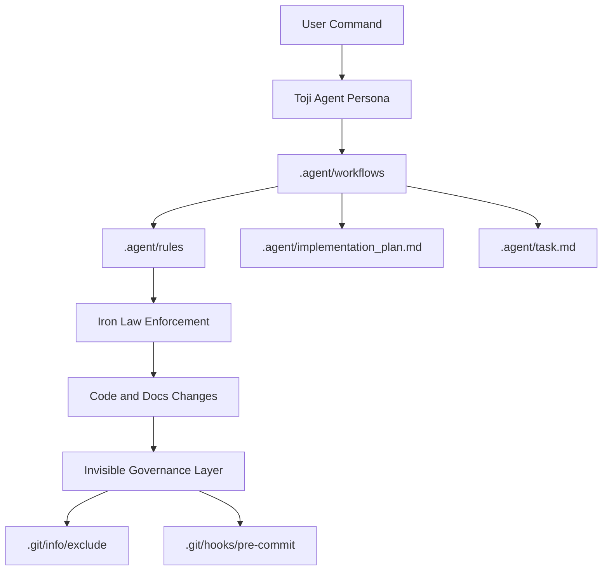

# Toji Agent Technical Manual

This document is the operating contract for Toji after the architecture migration to the `.agent/` engine.

If you need a fast overview, read `README.md`. If you need implementation detail, read this file end to end.

## 1. Core Philosophy

Toji is built to counter AI engineering drift.

Drift means:

- writing code before requirements are pinned
- skipping failing tests and calling it done
- inventing APIs that do not exist
- leaking governance noise into client-facing Git history

Toji prevents drift through two hard systems:

1. **Iron Laws** (behavior constraints)
2. **Invisible Governance** (local Git-level containment)

### Iron Laws (non-negotiable)

| Law | Enforcement intent | Operational effect |
|---|---|---|
| 1% Rule | If a skill might apply, load it first. | Skills cannot be skipped for convenience. |
| TDD Iron Law | Red-Green-Refactor required. | Production code before failing test is invalid. |
| TDD Delete Rule | Premature implementation must be deleted and rewritten in-cycle. | Stops rubber-stamp testing after the fact. |

| Security Iron Law | Evaluate OWASP boundary risk on sensitive changes. | Blocks insecure auth/input/query paths. |
| RCA Rule | Debug from evidence before fix attempts. | Prevents speculative patch loops. |

## 2. Architecture After Refactor

The old skill and prompt center of gravity was under `.github/skills/` and `.github/prompts/`.

The new core execution engine is under `.agent/`:

- `.github/skills/` holds canonical skill packs (`*/SKILL.md`)
- `.agent/workflows/` holds executable workflow contracts (`toji-plan.md`, `toji-build.md`, etc.)
- `.agent/agents/` holds agent personas (for example, `toji.agent.md`)

Legacy `.github` paths can still exist for compatibility and bridge behavior, but they are no longer the architectural center.

### Runtime relationship diagram



## 3. Folder Structure Reference

### `.agent/`

| Path | Purpose |
|---|---|
| `.github/skills/*/SKILL.md` | Canonical skill rules shared across Copilot and Antigravity. |
| `.agent/workflows/toji-plan.md` | Planning workflow contract for `/plan`. |
| `.agent/workflows/toji-build.md` | Build workflow contract for `/build` with mandatory TDD sequence. |
| `.agent/workflows/toji-verify.md` | Three-stage verification workflow for `/verify`. |
| `.agent/workflows/toji-debug.md` | Evidence-first debugging workflow for `/debug`. |
| `.agent/workflows/toji-onboard.md` | Governance bootstrap workflow for `/onboard`. |
| `.agent/workflows/toji-clarify.md` | Ambiguity interception workflow for `/clarify`. |
| `.agent/workflows/setup-mcps.md` | MCP setup automation workflow. |
| `.agent/agents/toji.agent.md` | Toji persona and command-to-workflow mapping. |
| `.agent/mcp_config.template.json` | MCP server template for local runtime configuration. |

### `scripts/`

| Path | Purpose |
|---|---|
| `scripts/linux/install.sh` | Main installer and governance bootstrapper. |
| `scripts/linux/update.sh` | In-place sync and heal without clobbering local memory. |
| `scripts/linux/check.sh` | Installation integrity checker. |
| `scripts/linux/uninstall.sh` | Removes Toji-managed artifacts and governance hooks. |
| `scripts/release/prepare-release.js` | Maintainer release prep: semver bump, docs-update guard, and changelog entry generation. |
| `scripts/release/release-utils.js` | Shared semantic-version and docs-impact logic for release automation. |
| `scripts/windows/windows_install.ps1` | Windows launcher for `install.sh` through Bash. |
| `scripts/windows/windows_update.ps1` | Windows launcher for `update.sh` through Bash. |
| `scripts/windows/windows_check.ps1` | Windows launcher for `check.sh` through Bash. |
| `scripts/windows/windows_uninstall.ps1` | Windows launcher for `uninstall.sh` through Bash. |

## 4. Cross-Platform Support

Toji supports Linux, macOS, and Windows.

- Linux and macOS run shell scripts directly.
- Windows uses PowerShell wrappers that require `bash` (Git Bash or WSL) and forward arguments to Linux scripts.
- This keeps one source of truth for installer logic while preserving native Windows entry points.

## 5. Installation Guide

Run commands from the target repository root.

### 5.1 Linux and macOS

Default install (Copilot bundle):

```bash
curl -fsSL https://raw.githubusercontent.com/kevsmir02/toji-agent/main/scripts/linux/install.sh | bash
```

Antigravity-only:

```bash
curl -fsSL https://raw.githubusercontent.com/kevsmir02/toji-agent/main/scripts/linux/install.sh | bash -s -- --antigravity
```

Copilot CLI-only:

```bash
curl -fsSL https://raw.githubusercontent.com/kevsmir02/toji-agent/main/scripts/linux/install.sh | bash -s -- --copilot-cli
```

Both bundles:

```bash
curl -fsSL https://raw.githubusercontent.com/kevsmir02/toji-agent/main/scripts/linux/install.sh | bash -s -- --both
```

All bundles:

```bash
curl -fsSL https://raw.githubusercontent.com/kevsmir02/toji-agent/main/scripts/linux/install.sh | bash -s -- --all
```

### 5.2 Windows (PowerShell wrappers)

Default install:

```powershell
iwr https://raw.githubusercontent.com/kevsmir02/toji-agent/main/scripts/windows/windows_install.ps1 -OutFile windows_install.ps1
./windows_install.ps1
```

Antigravity-only:

```powershell
./windows_install.ps1 -Antigravity
```

Copilot CLI-only:

```powershell
./windows_install.ps1 -CopilotCli
```

Both bundles:

```powershell
./windows_install.ps1 -Both
```

All bundles:

```powershell
./windows_install.ps1 -All
```

### 5.3 Prerequisites

Linux and macOS:

- `git`
- `awk`
- `sed`

Windows:

- `git`
- `powershell`
- `bash` via Git Bash or WSL

### 5.4 Post-install verification

Linux and macOS:

```bash
curl -fsSL https://raw.githubusercontent.com/kevsmir02/toji-agent/main/scripts/linux/check.sh | bash
```

Windows:

```powershell
iwr https://raw.githubusercontent.com/kevsmir02/toji-agent/main/scripts/windows/windows_check.ps1 -OutFile windows_check.ps1
./windows_check.ps1
```

## 6. Update Guide

Linux and macOS:

```bash
curl -fsSL https://raw.githubusercontent.com/kevsmir02/toji-agent/main/scripts/linux/update.sh | bash
```

Copilot CLI-only update:

```bash
curl -fsSL https://raw.githubusercontent.com/kevsmir02/toji-agent/main/scripts/linux/update.sh | bash -s -- --copilot-cli
```

All-surfaces update:

```bash
curl -fsSL https://raw.githubusercontent.com/kevsmir02/toji-agent/main/scripts/linux/update.sh | bash -s -- --all
```

Windows:

```powershell
iwr https://raw.githubusercontent.com/kevsmir02/toji-agent/main/scripts/windows/windows_update.ps1 -OutFile windows_update.ps1
./windows_update.ps1
```

Notable updater behavior:

- preserves local memory surfaces such as `docs/ai/`
- re-applies Invisible Governance excludes idempotently
- installs or refreshes Toji pre-commit guardrails
- supports dry run and mode-specific updates

### 6.1 Maintainer Release Prep (SemVer + Changelog)

Run this before maintainer commits that should update release metadata:

```bash
node scripts/release/prepare-release.js --bump <major|minor|patch> --summary "what changed"
```

The command performs three actions atomically:

1. Bumps `.github/toji-version.json` using Semantic Versioning.
2. Verifies docs hygiene: if impactful non-doc changes are detected without README/DOCUMENTATION/docs updates, it exits non-zero and blocks the release prep.
3. Appends a new release entry to `CHANGELOG.md` with summary, bump type, and auto-detected changed files.

SemVer reference:

- `major`: breaking changes, migration-required behavior, or compatibility breaks.
- `minor`: backward-compatible feature additions.
- `patch`: backward-compatible fixes and maintenance updates.

## 7. Uninstall Guide

### 7.1 Linux and macOS

Default uninstall from current repository:

```bash
curl -fsSL https://raw.githubusercontent.com/kevsmir02/toji-agent/main/scripts/linux/uninstall.sh | bash -s -- --target .
```

Antigravity-only uninstall:

```bash
curl -fsSL https://raw.githubusercontent.com/kevsmir02/toji-agent/main/scripts/linux/uninstall.sh | bash -s -- --target . --antigravity
```

Copilot CLI-only uninstall:

```bash
curl -fsSL https://raw.githubusercontent.com/kevsmir02/toji-agent/main/scripts/linux/uninstall.sh | bash -s -- --target . --copilot-cli
```

Both bundles:

```bash
curl -fsSL https://raw.githubusercontent.com/kevsmir02/toji-agent/main/scripts/linux/uninstall.sh | bash -s -- --target . --both
```

All bundles:

```bash
curl -fsSL https://raw.githubusercontent.com/kevsmir02/toji-agent/main/scripts/linux/uninstall.sh | bash -s -- --target . --all
```

### 7.2 Windows

Default uninstall:

```powershell
iwr https://raw.githubusercontent.com/kevsmir02/toji-agent/main/scripts/windows/windows_uninstall.ps1 -OutFile windows_uninstall.ps1
./windows_uninstall.ps1 -Target .
```

Dry run:

```powershell
./windows_uninstall.ps1 -Target . -DryRun
```

Antigravity-only:

```powershell
./windows_uninstall.ps1 -Target . -Antigravity
```

Copilot CLI-only:

```powershell
./windows_uninstall.ps1 -Target . -CopilotCli
```

Both bundles:

```powershell
./windows_uninstall.ps1 -Target . -Both
```

All bundles:

```powershell
./windows_uninstall.ps1 -Target . -All
```

## 8. Workflow Commands

Toji workflow execution is centered in `.agent/workflows/`.

| Command | Primary workflow source | Purpose |
|---|---|---|
| `/onboard` | `.agent/workflows/toji-onboard.md` | Establish governance baseline and Line in the Sand. |
| `/clarify` | `.agent/workflows/toji-clarify.md` | Resolve architecture ambiguities before planning. |
| `/plan` | `.agent/workflows/toji-plan.md` | Generate implementation plan and task artifact. |
| `/build` | `.agent/workflows/toji-build.md` | Execute one task with mandatory Red-Green-Refactor cycles. |
| `/verify` | `.agent/workflows/toji-verify.md` | Run spec, quality, and cleanup verification gates. |
| `/debug` | `.agent/workflows/toji-debug.md` | Perform RCA-first debugging workflow. |
| `/review` | Governance command layer | Adversarial quality gate used after `/verify` in medium and large scope. |

### 8.1 Profile selection quick reference

Use one persona (Toji) and select runtime profile from the first prompt line.

| Profile | Use when | Planning depth | Clarification budget | Verification depth | Prompt header |
|---|---|---|---|---|---|
| `Fast` | Trivial or Small work where speed matters. | Compact in-chat task list. | At most one blocking question. | Changed area plus one adjacent regression check. | `Operating profile: Fast` |
| `Balanced` (default) | Normal day-to-day implementation. | Concise plan with explicit assumptions. | Ask only when genuinely blocking. | Targeted checks with normal evidence depth. | `Operating profile: Balanced` |
| `Audit` | High-risk, high-impact, or compliance-sensitive work. | Full explicit plan traceability. | Clarify all blocking risk assumptions. | Deeper evidence, expanded risk and residual-risk reporting. | `Operating profile: Audit` |

Profiles tune execution style only. They do not replace persona governance and cannot weaken Iron Laws.

### 8.2 Profile selection

Select an Operating Profile manually from the prompt header:

1. `Operating profile: Fast` for Trivial/Small work.
2. `Operating profile: Balanced` for standard day-to-day implementation.
3. `Operating profile: Audit` for high-risk or compliance-sensitive work.

Profiles tune execution style only. They cannot override Iron Laws.

### 8.3 Profile rationale (mandatory)

Emit a profile rationale line before substantive content:

```text
[Profile: <Fast|Balanced|Audit>] Reason: <phrase>
```

### Command progression model

```text
/onboard -> /plan -> /build -> /verify -> /review
```

## 9. Invisible Governance Under The Hood

Invisible Governance is implemented by script logic, not documentation convention.

### 9.1 Exclude strategy

During install and update, Toji appends a marker and protected paths to `.git/info/exclude`:

- marker: `# Toji Agent - Invisible Governance (install.sh)`
- path groups: `docs/ai/`, `.agent/`, selected `.github/*` governance surfaces, and governance bridge files

The operation is idempotent. Re-running scripts does not duplicate lines.

### 9.2 Pre-commit strategy

Toji writes `.git/hooks/pre-commit` with a Toji guard marker and executable permissions.

Behavior includes:

- block staging of governance paths (for example `.agent/`, `docs/ai/`, skills and prompts surfaces)
- protect the Toji block inside `AGENTS.md`
- fail commit with explicit blocked path reporting

If a non-Toji pre-commit already exists, updater logic creates a timestamped backup before replacement.

### 9.3 Why this matters

- Clients receive product code, not governance scaffolding.
- Teams can evolve AI process rigor locally without polluting shared history.
- Toji memory (`docs/ai`, lessons) remains high-signal and private by default.

### 9.4 Publicizing Toji intentionally

If your team intentionally wants Toji files tracked in remote history:

1. Remove relevant Toji lines from `.git/info/exclude`.
2. Replace or disable the Toji pre-commit hook.
3. Stage and commit governance files explicitly.

Do this only by explicit team decision.

## 10. Operational Notes

- `install.sh` bootstraps by invoking `update.sh` with mode flags.
- Windows scripts are wrappers; they do not duplicate install logic.
- `update.sh` and `install.sh` include rollback protections around `.github/` and `.agent/` snapshots.
- `uninstall.sh` removes Toji-managed artifacts while attempting to preserve unrelated project files.

## 11. Recommended Daily Practice

1. Run `/onboard` once per repository.
2. Use `/plan` for all non-trivial tasks.
3. Execute `/build` task-by-task with TDD discipline.
4. Require `/verify` before considering work complete.
5. Gate merges with `/review` on medium and large scope changes.
