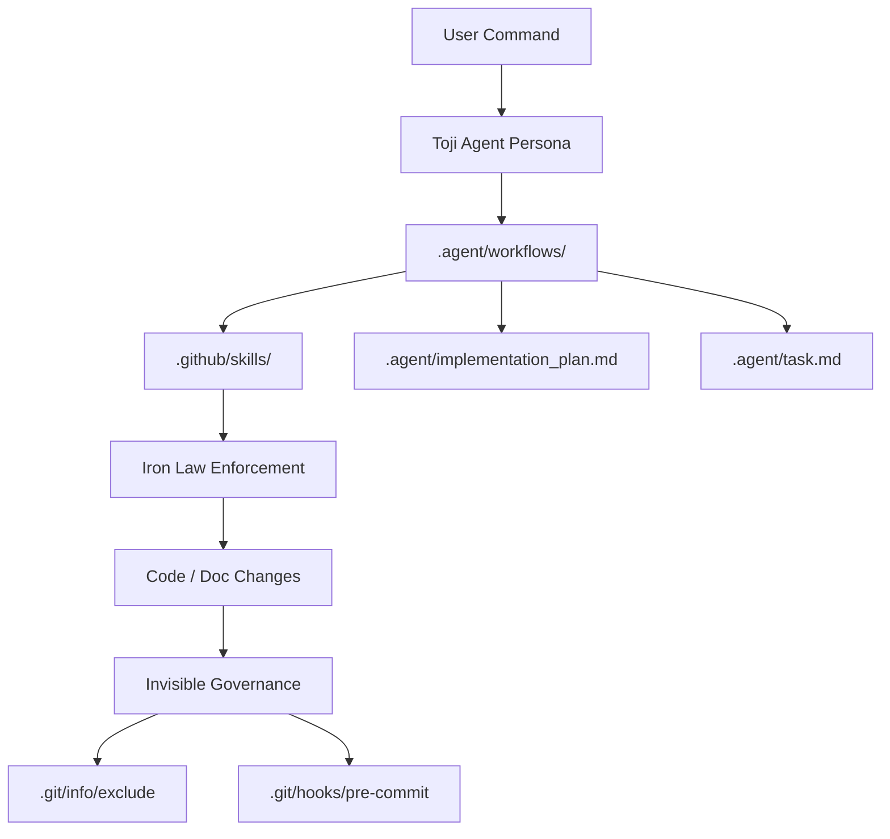

# Toji Agent — Technical Manual

Full reference for architecture, governance internals, scripts, and workflow behavior. For a quick start, see [README.md](README.md).

---

## 1. Architecture

Toji has two surfaces that work together:

| Surface | Purpose |
|---|---|
| `.github/skills/` | Canonical skill files (`*/SKILL.md`) shared across both Copilot and Antigravity |
| `.agent/` | Execution engine: workflows, agent persona, task files, and MCP config |

Both surfaces read from `docs/ai/governance-core.md` as the single truth source for Iron Laws, which is kept in sync via `scripts/sync-governance.js`.



---

## 2. Iron Laws

These rules cannot be bypassed or skipped for convenience.

| Law | What it does |
|---|---|
| **1% Rule** | If a skill might apply, load it before acting. No exceptions for "simple" tasks. |
| **TDD Iron Law** | Write a failing test first. Observe failure. Then implement. Production code written before a failing test must be deleted and rewritten. |
| **Research-First Iron Law** | Before writing integration code for any external framework, API, or service, look up the documentation and cite the source. |
| **Security Iron Law** | When touching auth, input handling, routes, uploads, queries, or async operations, silently evaluate the OWASP Threat Matrix. Block any code with a FAIL result. |
| **Code Quality Iron Law** | Evaluate for nesting depth, duplication, over-abstraction, N+1 queries, unbounded loops, and incorrect HTTP verbs or status codes. Block violations. |
| **RCA Rule** | Collect evidence and identify root cause before applying any fix. No speculative patches. |
| **Ambiguity Iron Law** | Before planning any feature request that lacks architectural specifics, trigger `ambiguity-resolver` and ask 2–3 clarifying questions. |
| **Baseline Validation Iron Law** | After a plan is approved, silently validate it against all Iron Laws before `/build` executes. Auto-rewrite violating sections. |
| **Physical Memory Iron Law** | For Small scope or larger: create `.agent/implementation_plan.md` and `.agent/task.md` before coding. Update checkboxes after each task. On session start, read `task.md` first. Delete both files when all tasks are done. |
| **UI Reasoning Engine Iron Law** | Before writing any frontend UI code, verify a design system exists. Adhere to its tokens. Block generic or hallucinated CSS/Tailwind classes. |
| **Delete Rule** | When verify or design compliance fails for new or changed lines, remove the violating code and rewrite it with approved patterns. |

---

## 3. Folder Structure

### `.github/`

| Path | Purpose |
|---|---|
| `.github/skills/*/SKILL.md` | Canonical skill rules |
| `.github/copilot-instructions.md` | Full Copilot agent configuration and skill index |
| `.github/copilot-instructions.template.md` | Source template — must stay in sync with `copilot-instructions.md` |
| `.github/prompts/*.prompt.md` | Slash command implementations (`/plan`, `/build`, `/verify`, etc.) |
| `.github/agents/toji.agent.md` | Toji agent persona for GitHub Copilot |
| `.github/instructions/*.instructions.md` | Path-specific instruction files auto-attached by Copilot |
| `.github/lessons-learned.md` | Permanent project-level instinct log |

### `.agent/`

| Path | Purpose |
|---|---|
| `.agent/workflows/*.md` | Executable workflow contracts for each slash command |
| `.agent/agents/toji.agent.md` | Toji persona for Antigravity |
| `.agent/rules/` | Antigravity-specific rule wrappers |
| `.agent/mcp_config.template.json` | MCP server template |
| `.agent/implementation_plan.md` | Active implementation plan (Physical Memory — deleted on completion) |
| `.agent/task.md` | Active task checklist (Physical Memory — deleted on completion) |

### `docs/ai/`

| Path | Purpose |
|---|---|
| `docs/ai/README.md` | Project state, governance log, backlog of intent |
| `docs/ai/governance-core.md` | Canonical Iron Laws source — synced to both agent files |
| `docs/ai/features/*.md` | Feature briefs — canonical source of requirements and acceptance criteria |
| `docs/ai/implementation/*.md` | Implementation notes, patterns, setup details |
| `docs/ai/testing/*.md` | Test strategy, coverage notes, validation checklists |
| `docs/ai/deployment/README.md` | Deployment checklist and environment notes |
| `docs/ai/onboarding/` | Onboarding artifacts: log, legacy baseline, integrity roadmap |

### `scripts/`

| Path | Purpose |
|---|---|
| `scripts/linux/install.sh` | Installer and governance bootstrapper |
| `scripts/linux/update.sh` | In-place sync — preserves local memory |
| `scripts/linux/check.sh` | Installation integrity checker |
| `scripts/linux/uninstall.sh` | Removes Toji-managed artifacts |
| `scripts/windows/windows_install.ps1` | Windows launcher for `install.sh` |
| `scripts/windows/windows_update.ps1` | Windows launcher for `update.sh` |
| `scripts/windows/windows_check.ps1` | Windows launcher for `check.sh` |
| `scripts/windows/windows_uninstall.ps1` | Windows launcher for `uninstall.sh` |
| `scripts/sync-governance.js` | Syncs Iron Laws from `docs/ai/governance-core.md` to both agent files |
| `scripts/check-skill-refs.js` | Scans `.md` files for skill references and verifies SKILL.md files exist on disk |

---

## 4. Skill System

Skills live in `.github/skills/<name>/SKILL.md`. Each skill is a domain-specific workflow — the agent reads the relevant skill before acting in that domain.

### Always-active (passive) skills

These fire automatically based on context via the 1% Rule:

| Skill | Trigger |
|---|---|
| `test-driven-development` | Any production code change |
| `research-first` | Integration with any external framework, API, or service |
| `security` | Auth, input handling, routes, queries, uploads, async ops |
| `defensive-coding` | Data fetching, error handlers, list views, async operations |
| `accessibility` | Any frontend UI file |
| `state-management` | Adding stores, contexts, data fetching hooks, global state |
| `simplify-implementation` | Code review, `/refactor`, Code Quality Iron Law trigger |
| `ambiguity-resolver` | `/plan` or any feature request lacking architectural specifics |
| `baseline-validator` | After plan approval, before `/build` |
| `performance` | Database queries, API endpoints, data processing |
| `api-design` | API controller or resource files |

### Stack skills (activated by `/detect-stack`)

| Stack ID | SKILL.md | Detection signals |
|---|---|---|
| `laravel-inertia-react` | `.github/skills/stack-laravel-inertia-react/SKILL.md` | `artisan` + Inertia + React deps |
| `mern` | `.github/skills/stack-mern/SKILL.md` | MongoDB/Mongoose + Express + React |
| `react-native-bare` | `.github/skills/stack-react-native-bare/SKILL.md` | `react-native` without `expo` + `android/` or `ios/` |
| `stack-nextjs` | `.github/skills/stack-nextjs/SKILL.md` | `next` in deps + `next.config.*` |
| `stack-generic-spa` | `.github/skills/stack-generic-spa/SKILL.md` | React present, no other stack marker matches |

### Optional domain skills

| Skill | When to use |
|---|---|
| `ux-design` | Multi-step flows, form-heavy pages, navigation design |
| `ux-design-rn` | React Native screen or navigator work |
| `ui-reasoning-engine` | All frontend UI code — verifies design system and token usage |
| `frontend-design-rn` | React Native styling and design token conventions |
| `testing-strategy` | Deciding which type of test to write for each layer |
| `deployment-safety` | Migrations, CI/CD config, environment configuration |
| `scan-codebase` | `/scan` — produces project architecture map |
| `capture-knowledge` | `/document` — documents a module or function in depth |
| `debug` | `/debug` — evidence-first root cause analysis |
| `dev-lifecycle` | Scope classification (Trivial / Small / Medium / Large) |
| `onboarding` | `/onboard` — Fresh Start or Legacy Integration |
| `technical-writer` | Reviewing or improving documentation |

---

## 5. Governance — Invisible Mode

Toji governance files are kept off shared Git history using two mechanisms.

### `.git/info/exclude`

During install and update, Toji appends protected paths to `.git/info/exclude` (never to `.gitignore`):

```
# Toji Agent - Invisible Governance
docs/ai/
.agent/
.github/skills/
.github/prompts/
.github/agents/
.github/instructions/toji-stack-*.instructions.md
.github/lessons-learned.md
```

The operation is idempotent — re-running scripts does not duplicate lines.

### Pre-commit hook

Toji writes a guard block to `.git/hooks/pre-commit`. The hook:
- blocks staging of governance paths
- protects the Toji block inside `AGENTS.md`
- reports exactly which paths were blocked

If a non-Toji pre-commit hook already exists, the updater creates a timestamped backup before replacing it.

### Publicizing Toji intentionally

If your team wants governance files tracked in remote history:

1. Remove the Toji lines from `.git/info/exclude`.
2. Replace or disable the Toji pre-commit hook block.
3. Stage and commit governance files explicitly.

Do this only by explicit team decision. Client-facing repositories should leave Invisible Mode active.

### Commits inside the toji-agent source repo

The pre-commit hook will block staging of its own governance files. Use `--no-verify` when committing inside this repository:

```bash
git commit --no-verify -m "..."
```

---

## 6. Physical Memory

Physical Memory is the session-persistence mechanism. It uses two files:

| File | Purpose |
|---|---|
| `.agent/implementation_plan.md` | Full technical spec for the active mission |
| `.agent/task.md` | Checkbox tracker — updated after each unit of work |

Task states: `[ ]` not started → `[/]` in progress → `[x]` complete.

On session start, Toji reads `.agent/task.md` first and resumes from the first unchecked or in-progress task.

When all tasks are `[x]`, both files are deleted. They are local-only (covered by `.git/info/exclude`).

Physical Memory does not replace `docs/ai/features/*.md`. Feature briefs are the canonical source of requirements and acceptance criteria. Physical Memory is the execution state.

---

## 7. Scope-Tiered Workflow

Classify scope before choosing a workflow.

| Scope | Signals | Workflow |
|---|---|---|
| **Trivial** | Single-file edit, no new entities | `/build` only |
| **Small** | 1–3 files, no new domain entities | `/plan` → `/build` → `/verify` |
| **Medium** | New domain entity, new API endpoints, schema changes | `/plan` → `/build` → `/verify` → `/review` |
| **Large** | New subsystem, cross-cutting architecture | `/requirements` → `/plan` → `/build` → `/verify` → `/review` |

All scopes: TDD Iron Law applies. Physical Memory required for Small and above.

---

## 8. Slash Commands

| Command | Workflow file | Purpose |
|---|---|---|
| `/onboard` | `.agent/workflows/toji-onboard.md` | Governance baseline, Line in the Sand, legacy legalization |
| `/clarify` | `.agent/workflows/toji-clarify.md` | Resolve ambiguity before planning |
| `/plan` | `.agent/workflows/toji-plan.md` | Feature brief + implementation plan + task file |
| `/build` | `.agent/workflows/toji-build.md` | TDD task execution |
| `/build-tdd` | `.github/prompts/build-tdd.prompt.md` | Failing tests first, then implement |
| `/verify` | `.agent/workflows/toji-verify.md` | Spec compliance, quality, cleanup |
| `/review` | `.github/prompts/review.prompt.md` | Adversarial pre-push gate |
| `/debug` | `.agent/workflows/toji-debug.md` | Evidence-first RCA workflow |
| `/detect-stack` | `.github/prompts/detect-stack.prompt.md` | Detect framework, activate stack skill, update Tier 2 artifacts |
| `/scan` | `.github/prompts/scan.prompt.md` | Produce codebase architecture map |
| `/refactor` | `.github/prompts/refactor.prompt.md` | Simplify and reduce complexity |
| `/document` | `.github/prompts/document.prompt.md` | Document module + session handover |
| `/commit` | `.github/prompts/commit.prompt.md` | Generate Conventional Commits message |
| `/lesson` | `.github/prompts/lesson.prompt.md` | Manually record a governance instinct |
| `/update-toji` | `.github/prompts/update.prompt.md` | Version check + Rule Diff before running `update.sh` |

---

## 9. Install / Update / Uninstall

### Prerequisites

| OS | Requirements |
|---|---|
| Linux / macOS | `git`, `awk`, `sed` |
| Windows | `git`, PowerShell, Git Bash or WSL |

### Install

```bash
# Linux / macOS — Copilot (default)
curl -fsSL https://raw.githubusercontent.com/kevsmir02/toji-agent/main/scripts/linux/install.sh | bash

# Linux / macOS — Antigravity only
curl -fsSL https://raw.githubusercontent.com/kevsmir02/toji-agent/main/scripts/linux/install.sh | bash -s -- --antigravity

# Linux / macOS — Both
curl -fsSL https://raw.githubusercontent.com/kevsmir02/toji-agent/main/scripts/linux/install.sh | bash -s -- --both
```

```powershell
# Windows — Copilot (default)
iwr https://raw.githubusercontent.com/kevsmir02/toji-agent/main/scripts/windows/windows_install.ps1 -OutFile windows_install.ps1
./windows_install.ps1

# Antigravity only
./windows_install.ps1 -Antigravity

# Both
./windows_install.ps1 -Both
```

### Verify install

```bash
# Linux / macOS
curl -fsSL https://raw.githubusercontent.com/kevsmir02/toji-agent/main/scripts/linux/check.sh | bash

# Windows
./windows_check.ps1
```

### Update

```bash
# Linux / macOS
curl -fsSL https://raw.githubusercontent.com/kevsmir02/toji-agent/main/scripts/linux/update.sh | bash

# Windows
./windows_update.ps1
```

The updater:
- preserves `docs/ai/`, `.github/lessons-learned.md`, and project-specific memory
- re-applies `.git/info/exclude` idempotently
- refreshes the pre-commit hook
- backs up any non-Toji pre-commit hook before replacing it

Before running `update.sh`, run `/update-toji` in your agent to get a Rule Diff showing what changed upstream.

### Uninstall

```bash
# Linux / macOS
curl -fsSL https://raw.githubusercontent.com/kevsmir02/toji-agent/main/scripts/linux/uninstall.sh | bash -s -- --target .

# Antigravity only
curl -fsSL https://raw.githubusercontent.com/kevsmir02/toji-agent/main/scripts/linux/uninstall.sh | bash -s -- --target . --antigravity

# Both bundles
curl -fsSL https://raw.githubusercontent.com/kevsmir02/toji-agent/main/scripts/linux/uninstall.sh | bash -s -- --target . --both
```

```powershell
# Windows
./windows_uninstall.ps1 -Target .

# Dry run
./windows_uninstall.ps1 -Target . -DryRun

# Antigravity only
./windows_uninstall.ps1 -Target . -Antigravity
```

---

## 10. Governance Sync

`scripts/sync-governance.js` keeps Iron Laws consistent between:
- `docs/ai/governance-core.md` (source)
- `.agent/agents/toji.agent.md` (Antigravity)
- `.github/agents/toji.agent.md` (Copilot)

Run after editing `governance-core.md`:

```bash
node scripts/sync-governance.js
```

`scripts/check-governance-sync.js` verifies sync without making changes:

```bash
node scripts/check-governance-sync.js
```

### Skill reference integrity

`scripts/check-skill-refs.js` scans all `.md` files for `.github/skills/<name>/SKILL.md` references and verifies each exists on disk:

```bash
node scripts/check-skill-refs.js --verbose
```

Exit 0 = all references valid. Exit 1 = phantom references found with a report of which files contain them.

---

## 11. Lessons Learned

`.github/lessons-learned.md` is the permanent, project-scoped instinct log.

Toji appends to it automatically when a response produces a **Pattern Change**, **RCA Discovery**, or **Course Correction** insight. Use `/lesson` to force an entry.

This file is local-only (Invisible Governance) and survives framework updates. It is not replaced by `update.sh`.
