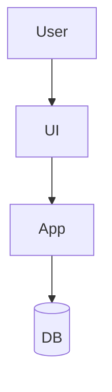

# Feature Brief

Use one file per feature: `docs/ai/features/{name}.md`.

This is the primary feature document. It replaces separate requirements, design, and planning files.

## Frontmatter

```yaml
---
name: {name}
status: proposed
owner: 
created: YYYY-MM-DD
updated: YYYY-MM-DD
---
```

## Summary

- One-paragraph overview of the feature
- Current status and why this work matters now

## Problem

### Problem Statement
- What problem are we solving?
- Who is affected?
- What is the current workaround or failure mode?

### Goals
- Primary outcomes
- Secondary outcomes

### Non-Goals
- Explicitly out-of-scope items

## Users & Scenarios

### Primary Users
- Who will use or be affected by this feature?

### User Stories
- As a [user type], I want to [action] so that [benefit]
- As a [user type], I want to [action] so that [benefit]

### Critical Flows
- Happy path
- Error and recovery path
- Edge cases worth preserving

## Solution

### Proposed Approach
- High-level solution summary
- Why this approach fits the problem and constraints

### Architecture Overview
- Include a mermaid diagram when multiple components or data flows are involved



### Components & Responsibilities
- Backend modules / services / actions
- Frontend pages / components
- Jobs, integrations, or external systems

### Data & Contracts
- Core entities, DTOs, or payload shapes
- Request/response or event contracts
- Auth, validation, and authorization boundaries

### Key Decisions
- Important technical decisions and trade-offs
- Alternatives considered and why they were rejected

## Delivery Plan

### Milestones
- [ ] Milestone 1: [Description]
- [ ] Milestone 2: [Description]

### Task Breakdown

#### Phase 1
- [ ] Task 1
- [ ] Task 2

#### Phase 2
- [ ] Task 3
- [ ] Task 4

### Dependencies
- External dependencies
- Sequencing constraints
- Cross-team or review dependencies

### Risks & Mitigations
- Risk
- Mitigation

## Validation

### Success Criteria
- Measurable outcomes
- Acceptance criteria

### Test Strategy Summary
- Unit / feature / integration expectations
- Manual QA notes
- Link to `docs/ai/testing/{name}.md` when a separate test plan exists

## Open Questions

- Outstanding decisions
- Assumptions that still need validation