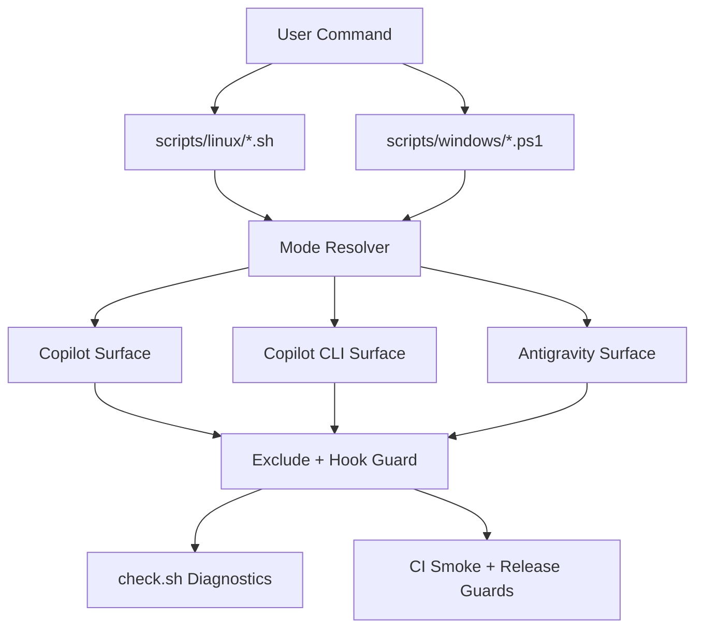

## Summary

Add first-class Copilot CLI support to the Toji framework with parity across Linux scripts, Windows wrappers, governance safeguards, documentation, and CI checks.

This feature is compatibility-first. Existing behavior for current modes remains stable while introducing a clear Copilot CLI mode and an all-surfaces mode.

## Problem

### Problem Statement

The current installer and maintenance flows support Copilot and Antigravity surfaces, but do not define an explicit Copilot CLI surface contract. This creates ambiguity in installation semantics, update behavior, exclusion coverage, and verification.

### Goals

- Add explicit Copilot CLI mode support in install, update, check, and uninstall workflows.
- Preserve backward compatibility for current mode flags and defaults.
- Keep Invisible Governance intact for new Copilot CLI artifacts.
- Add validation coverage so mode drift is caught in CI and release checks.

### Non-Goals

- Replacing existing Copilot or Antigravity surfaces.
- Rewriting release automation beyond what is needed for Copilot CLI parity checks.
- Introducing per-project behavior overrides for governance laws.

## Users And Scenarios

### Primary Users

- Toji maintainers evolving framework distribution.
- Developers installing Toji in consumer repositories.
- Teams verifying install health in CI.

### User Stories

- As a maintainer, I want a dedicated Copilot CLI mode so support is explicit and testable.
- As a developer, I want one consistent mode matrix across Linux and Windows wrappers.
- As a reviewer, I want CI to fail when Copilot CLI support drifts from declared behavior.

### Critical Flows

- Happy path: install Copilot CLI mode from local source and remote source.
- Upgrade path: run update in Copilot CLI mode without clobbering docs/ai or lessons memory.
- Validation path: check script reports Copilot CLI health with clear pass/fail output.
- Cleanup path: uninstall removes Copilot CLI assets and excludes while preserving unrelated files.

## Solution

### Proposed Approach

Introduce a new mode contract with compatibility guarantees:

- default mode: copilot
- explicit modes: copilot-cli, antigravity
- compatibility mode: both (copilot + antigravity)
- full mode: all (copilot + copilot-cli + antigravity)

This approach avoids breaking existing users while enabling full Copilot CLI support.

### Architecture Overview



### Components And Responsibilities

- Linux scripts:
  - scripts/linux/install.sh: mode parse and update dispatch.
  - scripts/linux/update.sh: sync/exclude/hook logic for copilot-cli.
  - scripts/linux/check.sh: mode-aware health checks.
  - scripts/linux/uninstall.sh: mode-aware cleanup.
- Windows wrappers:
  - scripts/windows/windows_install.ps1
  - scripts/windows/windows_update.ps1
  - scripts/windows/windows_check.ps1
  - scripts/windows/windows_uninstall.ps1
- Governance and validation:
  - scripts/check-governance-sync.js
  - scripts/sync-governance.js
  - .github/workflows/ci.yml
  - scripts/release/*.test.js
- Documentation:
  - README.md
  - DOCUMENTATION.md

### Data And Contracts

- CLI contract is flag-based and deterministic.
- Mutually exclusive mode flags remain enforced.
- Exclusion and pre-commit guard logic must block Copilot CLI governance artifacts in consumer repositories.

### Key Decisions

- Decision: add copilot-cli as explicit mode instead of changing default behavior.
  - Reason: avoid breaking established no-flag Copilot installs.
- Decision: add all mode rather than changing both semantics.
  - Reason: preserve compatibility for current users of both.
- Decision: keep source-vs-consumer contract unchanged.
  - Reason: maintainer doctrine requires single-source policy and invisible governance discipline.

## Visual Strategy

Design archetype: N/A.

This feature is CLI and script behavior only, with no user-visible frontend surface.

## Risk Surface

### Input Surface

User-controlled inputs are shell and PowerShell flags, source path/url values, and target paths.

### Data Exposure

Scripts read local file paths, git metadata, and repository structure. No sensitive payloads are introduced. Risk is accidental logging of local paths; logs must remain minimal.

### Auth Boundary

No authentication boundary changes. Scope is local developer tooling and repository files.

### Performance Pressure

Worst case is recursive copy/find operations during update and uninstall on large repositories. Existing bounded directory targeting should be preserved to avoid unbounded scans.

## Delivery Plan

### Milestones

- [ ] Milestone 1: Establish mode contract and script flag parity.
- [ ] Milestone 2: Implement Copilot CLI sync, excludes, checks, and uninstall behavior.
- [ ] Milestone 3: Add docs, tests, and CI coverage for Copilot CLI support.

### Task Breakdown

#### Phase 1 - Contract and Parsing

- [ ] Task 1: Add mode constants and flag parser updates for copilot-cli and all in scripts/linux/install.sh.
  - Files: scripts/linux/install.sh
  - Edit intent:
    ```bash
    INSTALL_MODE=copilot
    COPILOT_CLI_FLAG=0
    ALL_FLAG=0
    # add --copilot-cli and --all parsing
    # enforce mutual exclusivity across --antigravity --both --copilot-cli --all
    ```
  - Verify: bash -n scripts/linux/install.sh

- [ ] Task 2: Mirror mode parser changes in scripts/linux/update.sh.
  - Files: scripts/linux/update.sh
  - Edit intent:
    ```bash
    UPDATE_MODE=copilot
    COPILOT_CLI_FLAG=0
    ALL_FLAG=0
    # update usage text and flag parser
    # preserve existing default behavior
    ```
  - Verify: bash -n scripts/linux/update.sh

- [ ] Task 3: Add mode parser and help updates in scripts/linux/check.sh.
  - Files: scripts/linux/check.sh
  - Edit intent:
    ```bash
    # support --copilot-cli and --all
    # run copilot-cli checks in copilot-cli and all modes
    ```
  - Verify: bash -n scripts/linux/check.sh

- [ ] Task 4: Add mode parser and usage updates in scripts/linux/uninstall.sh.
  - Files: scripts/linux/uninstall.sh
  - Edit intent:
    ```bash
    UNINSTALL_MODE=copilot
    COPILOT_CLI_FLAG=0
    ALL_FLAG=0
    # remove copilot-cli assets by mode
    ```
  - Verify: bash -n scripts/linux/uninstall.sh

#### Phase 2 - Behavior and Governance

- [ ] Task 5: Implement copilot-cli sync branch in scripts/linux/update.sh.
  - Files: scripts/linux/update.sh
  - Edit intent:
    ```bash
    if [[ "$UPDATE_MODE" == copilot-cli || "$UPDATE_MODE" == all ]]; then
      # sync copilot-cli governance files from source
      # ensure destination directories exist
    fi
    ```
  - Verify: bash scripts/linux/update.sh --source . --dry-run --copilot-cli

- [ ] Task 6: Extend apply_excludes_for_mode for copilot-cli and all.
  - Files: scripts/linux/update.sh
  - Edit intent:
    ```bash
    copilot-cli)
      ensure_exclude_line "<copilot-cli-path-1>"
      ;;
    all)
      # include copilot + copilot-cli + antigravity excludes
      ;;
    ```
  - Verify: bash scripts/linux/update.sh --source . --dry-run --all

- [ ] Task 7: Add copilot-cli checks in scripts/linux/check.sh output sections.
  - Files: scripts/linux/check.sh
  - Edit intent:
    ```bash
    section "[ Copilot CLI ]"
    check_file "..." "..."
    ```
  - Verify: bash scripts/linux/check.sh --copilot-cli

- [ ] Task 8: Add copilot-cli uninstall paths and exclude cleanup entries.
  - Files: scripts/linux/uninstall.sh
  - Edit intent:
    ```bash
    copilot-cli)
      remove_path "$TARGET_DIR/<copilot-cli-file>"
      remove_toji_exclude_lines "$TARGET_DIR" copilot-cli
      ;;
    ```
  - Verify: bash scripts/linux/uninstall.sh --target . --dry-run --copilot-cli

#### Phase 3 - Windows Wrapper Parity

- [ ] Task 9: Add -CopilotCli and -All switches to windows_install.ps1 and forward to Linux flags.
  - Files: scripts/windows/windows_install.ps1
  - Verify: pwsh -File scripts/windows/windows_install.ps1 -Help

- [ ] Task 10: Add -CopilotCli and -All switches to windows_update.ps1.
  - Files: scripts/windows/windows_update.ps1
  - Verify: pwsh -File scripts/windows/windows_update.ps1 -Help

- [ ] Task 11: Add -CopilotCli and -All switches to windows_check.ps1.
  - Files: scripts/windows/windows_check.ps1
  - Verify: pwsh -File scripts/windows/windows_check.ps1 -Help

- [ ] Task 12: Add -CopilotCli and -All switches to windows_uninstall.ps1.
  - Files: scripts/windows/windows_uninstall.ps1
  - Verify: pwsh -File scripts/windows/windows_uninstall.ps1 -Help

#### Phase 4 - Docs, Tests, and CI

- [ ] Task 13: Update mode tables and examples in README.md.
  - Files: README.md
  - Verify: grep -n "copilot-cli\|--all" README.md

- [ ] Task 14: Update technical manual mode semantics in DOCUMENTATION.md.
  - Files: DOCUMENTATION.md
  - Verify: grep -n "copilot-cli\|--all" DOCUMENTATION.md

- [ ] Task 15: Add regression tests for mode parsing and release guards.
  - Files:
    - scripts/release/install-receipt-guard.test.js
    - scripts/release/precommit-release-automation.test.js
    - scripts/release/release-utils.test.js
  - Verify:
    - node scripts/release/install-receipt-guard.test.js
    - node scripts/release/precommit-release-automation.test.js
    - node scripts/release/release-utils.test.js

- [ ] Task 16: Expand CI smoke workflow with Copilot CLI dry-run checks.
  - Files: .github/workflows/ci.yml
  - Verify: grep -n "copilot-cli\|--all" .github/workflows/ci.yml

#### Phase 5 - End-to-End Validation

- [ ] Task 17: Run Linux syntax checks.
  - Commands:
    - bash -n scripts/linux/install.sh
    - bash -n scripts/linux/update.sh
    - bash -n scripts/linux/check.sh
    - bash -n scripts/linux/uninstall.sh

- [ ] Task 18: Run Linux dry-run matrix.
  - Commands:
    - bash scripts/linux/install.sh --source . --dry-run --copilot-cli
    - bash scripts/linux/update.sh --source . --dry-run --copilot-cli
    - bash scripts/linux/check.sh --copilot-cli
    - bash scripts/linux/uninstall.sh --target . --dry-run --copilot-cli
    - bash scripts/linux/update.sh --source . --dry-run --all

- [ ] Task 19: Run release guard tests.
  - Commands:
    - node scripts/release/install-receipt-guard.test.js
    - node scripts/release/precommit-release-automation.test.js
    - node scripts/release/release-utils.test.js

### Dependencies

- Confirm Copilot CLI artifact path conventions from official GitHub documentation before coding sync paths.
- Bash and PowerShell environments must both remain supported.

### Risks And Mitigations

- Risk: accidental mode breaking change.
  - Mitigation: preserve existing defaults and both semantics; add all as additive mode.
- Risk: exclude drift causing governance files to leak into commits.
  - Mitigation: update apply_excludes_for_mode and pre-commit guard checks with tests.
- Risk: wrapper mismatch across platforms.
  - Mitigation: enforce one-to-one flag parity and help text parity.

## Validation

### Success Criteria

- Copilot CLI mode is available in Linux and Windows command surfaces.
- check and uninstall support Copilot CLI with explicit diagnostics and cleanup behavior.
- Existing modes remain backward compatible.
- CI includes Copilot CLI smoke validation.

### Test Strategy Summary

- Shell syntax validation for all Linux scripts.
- Dry-run matrix for mode semantics.
- Node-based release guard regression scripts.
- Optional manual Windows wrapper validation in PowerShell.

## Open Questions

None. This plan is assumption-locked for compatibility-first delivery.