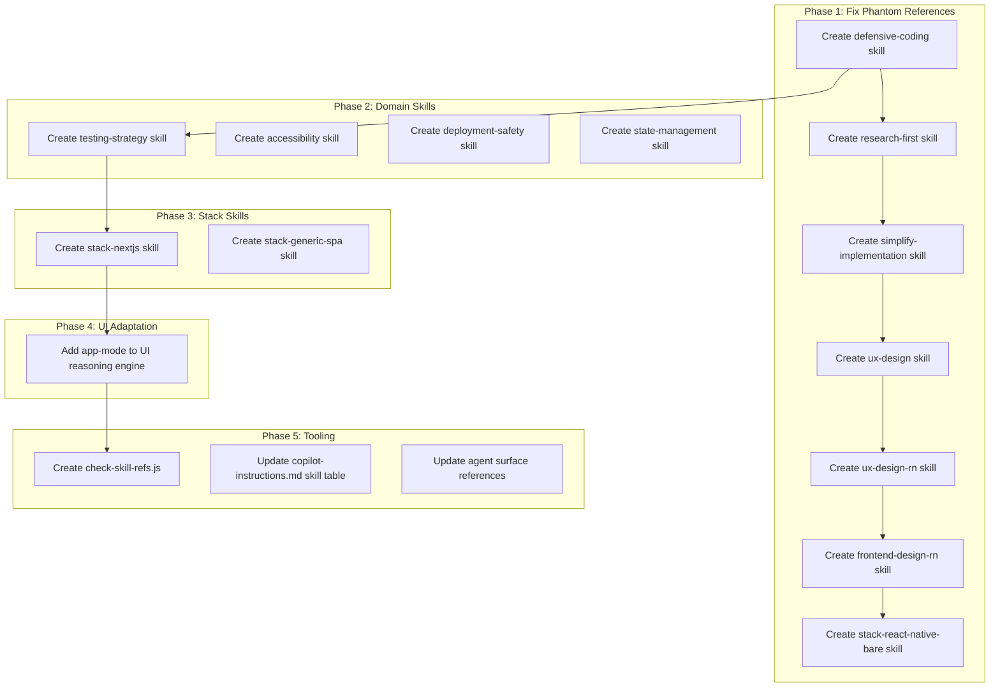

# Framework Completeness Audit — Fix Gaps for Full-Stack Web Development

## Summary

Toji's governance architecture is sound but incomplete. An internal audit identified phantom skill references (skills that are documented but don't exist), narrow stack coverage (2 of 10+ common full-stack stacks), missing domain skills critical for web development, context budget concerns, and a UI skill that defaults to the wrong aesthetic for application UIs. This feature brief covers all remediation work.

Current status: **Proposed. No code written yet.**

## Problem

### Problem Statement

Developers adopting Toji for full-stack web development encounter:

1. **Broken governance contracts** — The agent is instructed to load skills (`defensive-coding`, `research-first`, `simplify-implementation`, `ux-design`, `ux-design-rn`, `frontend-design-rn`, `stack-react-native-bare`) that do not exist. This causes silent failures, wasted context tokens on 404 file reads, and undermines trust in the framework's own discipline.
2. **Narrow stack coverage** — Only Laravel+Inertia+React and MERN have dedicated stack skills. Developers using Next.js, Django, NestJS, Rails, or other common stacks fall back to generic mode with minimal guardrails.
3. **Missing domain skills** — No dedicated accessibility, state management, testing strategy, deployment safety, or defensive coding skills exist, leaving significant full-stack surface area ungoverned.
4. **Context budget waste** — The 1% Rule can cascade 3–5 passive skill loads per turn, each 100–200 lines, exhausting model context before user code is read.
5. **UI skill misalignment** — The UI Reasoning Engine defaults to bold/maximalist aesthetics ("fiercely unique"), which is wrong for SaaS/enterprise application UI where consistency and usability dominate.
6. **Referential integrity** — No tooling exists to detect skill references that point to nonexistent files, so phantom references accumulate silently.

### Goals

- **P0**: Eliminate all phantom skill references (create missing skills or remove dangling references)
- **P0**: Create the `defensive-coding` skill (two existing stack skills depend on it)
- **P1**: Add 2–3 high-impact stack skills for broader full-stack coverage
- **P1**: Add critical domain skills (accessibility, testing-strategy, deployment-safety, state-management)
- **P2**: Make the UI Reasoning Engine context-adaptive (application vs marketing mode)
- **P2**: Add referential integrity tooling (`check-skill-refs.js`)
- **P3**: Add context budget guidance to skill loading

### Non-Goals

- Rewriting existing skills that work correctly (TDD, debug, security, performance, ambiguity-resolver, baseline-validator, etc.)
- Changing the Invisible Governance architecture (install/update/exclude/hook system)
- Adding non-web stacks (mobile-only, embedded, data science)
- Changing the Iron Laws themselves
- Full i18n or L10n skill (out of scope for this pass)

## Users & Scenarios

### Primary Users

- **Full-stack web developers** using Toji with stacks beyond Laravel+Inertia+React or MERN
- **Toji maintainers** who need referential integrity when adding/removing skills
- **Teams building SaaS/enterprise applications** who need application-UI-appropriate design guidance

### User Stories

- As a Next.js developer, I want a `stack-nextjs` skill so that the agent follows App Router, Server Component, and data-fetching conventions specific to my stack.
- As a developer, I want the agent to never reference skills that don't exist, so that governance feels reliable instead of broken.
- As a SaaS developer, I want the UI skill to default to usable, consistent application design rather than "fiercely unique bold layouts."
- As a maintainer, I want `check-skill-refs.js` to catch phantom references at authoring time.
- As a full-stack developer, I want an accessibility skill so that a11y discipline is enforced the same way security is.

### Critical Flows

- **Happy path**: Agent loads a stack skill that exists, applies its conventions, and produces correct code for that stack.
- **Error path (current)**: Agent reads `copilot-instructions.md`, sees `simplify-implementation` in skill table, tries to load `.github/skills/simplify-implementation/SKILL.md`, file doesn't exist, agent either hallucinates the skill content or silently skips it.
- **Edge case**: Developer uses an unsupported stack (e.g., Phoenix/Elixir). Agent falls back to generic mode gracefully with a note suggesting `/detect-stack` after adding a stack skill.

## Solution

### Proposed Approach

Organized into 5 phases by dependency order and priority:

1. **Phase 1 — Phantom Reference Elimination** (P0): Create all missing skills that are actively referenced, or remove dangling references where the skill concept is not needed.
2. **Phase 2 — New Domain Skills** (P1): Create `testing-strategy`, `accessibility`, `deployment-safety`, `state-management`.
3. **Phase 3 — New Stack Skills** (P1): Create `stack-nextjs` and `stack-generic-spa` fallback. Optionally `stack-django-react`.
4. **Phase 4 — UI Reasoning Engine Adaptation** (P2): Add application-mode vs marketing-mode branching.
5. **Phase 5 — Tooling & Sustainability** (P2–P3): Create `check-skill-refs.js`, add context budget notes.

### Architecture Overview

### Components & Responsibilities

**New Skills (Phase 1 — phantom fix)**:
- `.github/skills/defensive-coding/SKILL.md` — Resilience Matrix: error containment, edge case guards, loading/error/empty state enforcement, async error handling
- `.github/skills/research-first/SKILL.md` — Passive skill: documentation lookup before framework/API integration code, cite source
- `.github/skills/simplify-implementation/SKILL.md` — YAGNI gate: complexity scoring, duplication detection, over-abstraction prevention
- `.github/skills/ux-design/SKILL.md` — UX framework: user flows, navigation patterns, form design, interaction states, error recovery UX
- `.github/skills/ux-design-rn/SKILL.md` — React Native specialized UX: mobile navigation patterns, gesture handling, offline states
- `.github/skills/frontend-design-rn/SKILL.md` — React Native visual design: platform-adaptive styling, native component conventions
- `.github/skills/stack-react-native-bare/SKILL.md` — New Architecture defaults, React Navigation static API, secure storage, Metro config

**New Skills (Phase 2 — domain)**:
- `.github/skills/testing-strategy/SKILL.md` — Layer-appropriate test type selection (unit vs integration vs E2E vs contract), fixture discipline, coverage thresholds
- `.github/skills/accessibility/SKILL.md` — Passive like security: WCAG 2.1 AA checklist, semantic HTML, screen reader, color contrast, keyboard nav
- `.github/skills/deployment-safety/SKILL.md` — Migration ordering, feature flags, rollback, health checks, zero-downtime patterns
- `.github/skills/state-management/SKILL.md` — Decision tree: server state vs client state vs form state, library recommendations per pattern

**New Skills (Phase 3 — stack)**:
- `.github/skills/stack-nextjs/SKILL.md` — App Router, Server/Client Components, data fetching, middleware, ISR/SSG/SSR, Prisma/Drizzle patterns
- `.github/skills/stack-generic-spa/SKILL.md` — Fallback for unmatched stacks: API error handling, auth flow, route guarding, loading states

**Modifications (Phase 4–5)**:
- `.github/skills/ui-reasoning-engine/SKILL.md` — Add context-adaptive mode detection (application UI vs marketing/creative)
- `scripts/check-skill-refs.js` — Scan all `.md` files for skill directory references, verify each target exists on disk
- `.github/copilot-instructions.md` — Update skill table with all new skills
- `.github/copilot-instructions.template.md` — Mirror skill table update (Template Sync Discipline)
- `.agent/agents/toji.agent.md` — Fix passive skill references to match actual disk state
- `scripts/check-governance-sync.js` — Optionally integrate ref check into existing governance sync

### Key Decisions

1. **Create all 7 phantom skills rather than remove references** — The concepts are genuinely useful. Removing references would reduce framework capability. Exception: if a skill's concept is fully covered by an existing skill, merge the reference rather than create a hollow duplicate.
2. **`stack-generic-spa` as a fallback rather than nothing** — Better-than-nothing guidance for unmatched stacks prevents developers from getting zero conventions.
3. **UI mode detection over UI skill split** — One skill with a branching Step 0 is simpler than maintaining two parallel UI skills.
4. **`check-skill-refs.js` as a standalone script** — Keeps the check composable and runnable in CI without coupling to sync-governance.
5. **Phase ordering by dependency** — Phase 1 first because `defensive-coding` is a dependency of existing stack skills. Phase 5 last because it audits everything created in prior phases.

## Risk Surface

| Risk | Likelihood | Impact | Mitigation |
|---|---|---|---|
| Context budget increase from more skills | High | Medium | Add context weight notes; passive skills should front-load checklists, not prose |
| New stack skills drift from framework conventions | Medium | High | Each stack skill must reference Iron Laws; `check-skill-refs.js` catches drift |
| UI mode detection is ambiguous | Medium | Low | Default to application mode; only switch to marketing if feature brief explicitly says "landing page" or "marketing" |
| Skill quality varies without review | Medium | Medium | Each skill follows existing SKILL.md structure patterns; review against `baseline-validator` |

## Delivery Plan

### Milestones

- [ ] M1: All phantom references resolved (Phase 1 complete)
- [ ] M2: Domain skills created (Phase 2 complete)
- [ ] M3: Stack skills created (Phase 3 complete)
- [ ] M4: UI Reasoning Engine adapted (Phase 4 complete)
- [ ] M5: Tooling and cross-reference updates complete (Phase 5 complete)

### Task Breakdown

#### Phase 1 — Phantom Reference Elimination (P0)

- [ ] 1.1 Create `.github/skills/defensive-coding/SKILL.md`
- [ ] 1.2 Create `.github/skills/research-first/SKILL.md`
- [ ] 1.3 Create `.github/skills/simplify-implementation/SKILL.md`
- [ ] 1.4 Create `.github/skills/ux-design/SKILL.md`
- [ ] 1.5 Create `.github/skills/ux-design-rn/SKILL.md`
- [ ] 1.6 Create `.github/skills/frontend-design-rn/SKILL.md`
- [ ] 1.7 Create `.github/skills/stack-react-native-bare/SKILL.md`

#### Phase 2 — New Domain Skills (P1)

- [ ] 2.1 Create `.github/skills/testing-strategy/SKILL.md`
- [ ] 2.2 Create `.github/skills/accessibility/SKILL.md`
- [ ] 2.3 Create `.github/skills/deployment-safety/SKILL.md`
- [ ] 2.4 Create `.github/skills/state-management/SKILL.md`

#### Phase 3 — New Stack Skills (P1)

- [ ] 3.1 Create `.github/skills/stack-nextjs/SKILL.md`
- [ ] 3.2 Create `.github/skills/stack-generic-spa/SKILL.md`
- [ ] 3.3 Update `stack-router/SKILL.md` detection protocol for new stacks

#### Phase 4 — UI Reasoning Engine Adaptation (P2)

- [ ] 4.1 Add application-mode vs marketing-mode branching to `ui-reasoning-engine/SKILL.md`

#### Phase 5 — Tooling & Cross-Reference Updates (P2–P3)

- [ ] 5.1 Create `scripts/check-skill-refs.js`
- [ ] 5.2 Update `.github/copilot-instructions.md` skill table with all new skills
- [ ] 5.3 Update `.github/copilot-instructions.template.md` skill table (Template Sync Discipline)
- [ ] 5.4 Update `.agent/agents/toji.agent.md` passive skill references
- [ ] 5.5 Update `stack-router/SKILL.md` Tier 2 generation matrix for new stacks
- [ ] 5.6 Run `check-skill-refs.js` and confirm zero phantom references

### Dependencies

- Phase 1 must complete before Phase 5 (ref check would fail on phantoms)
- Task 1.1 (`defensive-coding`) is the highest priority — `stack-mern` and `stack-laravel-inertia-react` depend on it
- Phase 2–4 can execute in parallel after Phase 1
- Task 5.2 and 5.3 must be synchronized (Template Sync Discipline lesson)
